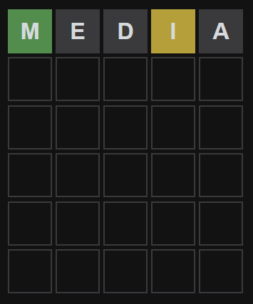

# WordleSolver

For educational purposes, a simple script that assists in solving the word game [Wordle](https://www.powerlanguage.co.uk/wordle/).

## Instructions

1. Pick your first word from the suggested words list or come up with your own word.
2. In the "Filtering out the top words." replace the string variable with the word you picked.
3. Update the Val enum values with the corresponding index of your word.
   - exactly: the letter is found in the word and in the correct spot.
   - exist: the letter is in the word but in the wrong spot.
   - nonexistent: the letter is not found in the word.

    ### Example
    

        word = 'media'
        validations = [Val.exactly, Val.nonexistent, Val.nonexistent, Val.exist, Val.nonexistent]

    - The first letter in my word is green so I will update the first item in the validations list to "Val.exactly"
    - The second letter is not found in the word so we change the second item in the validations list to "Val.nonexistent"
    - The fourth letter is found in the word but not in the correct spot so we change the fourth item in the validations list to "Val.exist"

4. Run the cell to generate a new list of words.
5. Repeat till you solve the word of the day.

## License

See the [LICENSE](LICENSE) file for license rights and limitations (MIT).
